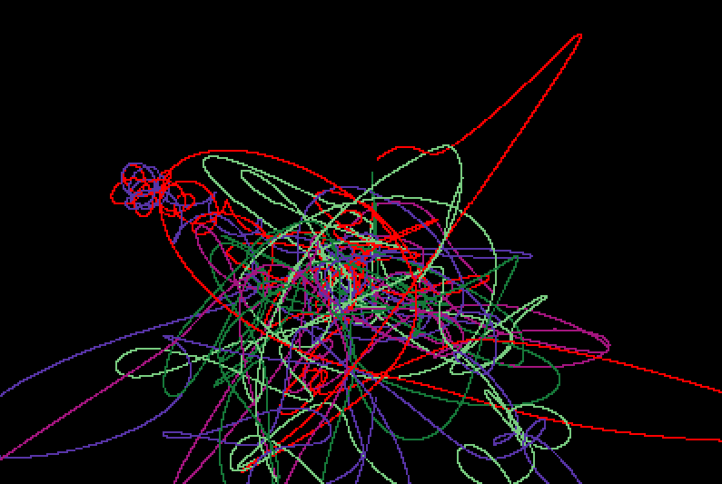

# nbsim
Simplistic n-body problem simulator in C++, currently using naive Euler method for numerical integration.
Uses minifb (https://github.com/emoon/minifb)

Stay tuned for improvements on the code!

